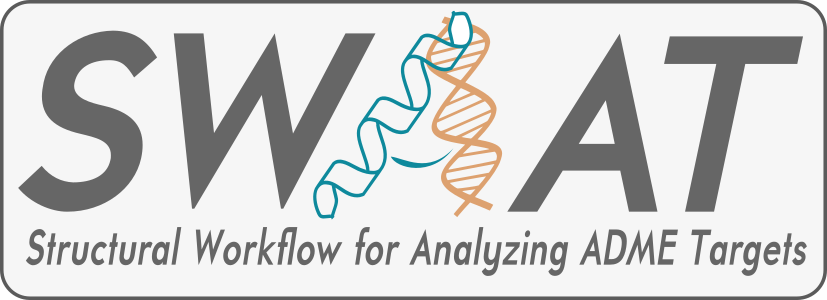

# SWAAT



## Preparing dependencies for the auxiliary workflow 

### Installing `tranvar`

```
# Use miniconda3 for a cleaner installation
pip install --user transvar

# set up databases
transvar config --download_anno --refversion hg19

# in case you don't have a reference
transvar config --download_ref --refversion hg19

# test
transvar panno -i 'PIK3CA:p.E545K' --ucsc --ccds
```

### Installing `BioPython`

```
pip install biopython
# Or if you prefer conda 
conda install -c anaconda biopython
conda install -c anaconda pandas
conda install -c anaconda scikit-learn 
 
```
### Installing dssp

```
git clone https://github.com/cmbi/dssp.git
cd dssp 
./autogen.sh
./configure
make
```

### Preparation of the PDB structures
A structuer is a chain
A structure must contain a chain identifier
Heteroatoms are not taken into account


